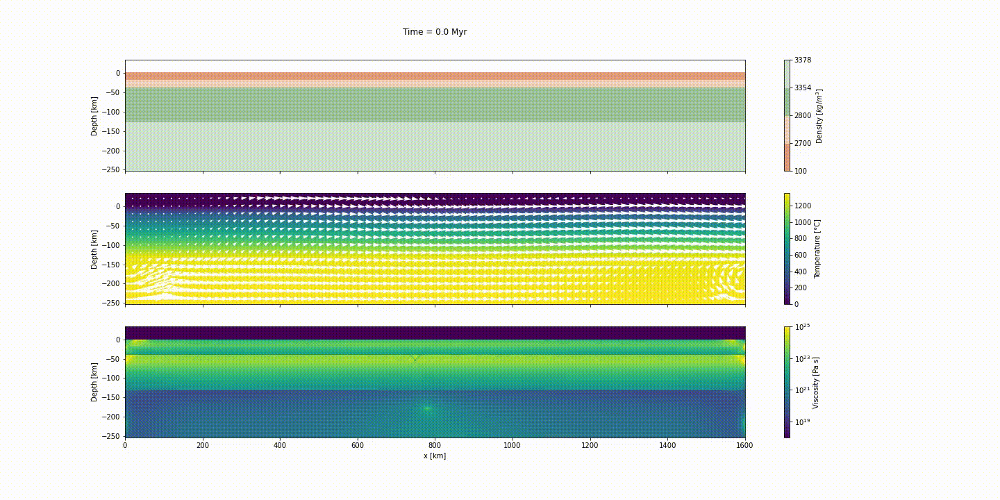

# Mandyoc: A finite element code to simulate thermochemical convection in parallel

The [Mandyoc tutorial at Transform 22](https://softwareunderground.org/t22-instructor-info)

**Instructors:**
[Agustina Pesce](https://github.com/aguspesce)1,2 ([ORCID](https://orcid.org/0000-0002-5538-8845)),
[Victor Sacek](https://github.com/victorsacek)3 ([ORCID](https://orcid.org/0000-0001-9598-5081)),
[Jamison Assunção](https://github.com/jamisonassuncao)3 ([ORCID](https://orcid.org/0000-0003-2822-2417)) and
[Rafael Monteiro da Silva](https://github.com/rafaelmds)3 ([ORCID](https://orcid.org/0000-0001-8645-2443))

> 1 Instituto Geofísico Sismológico Ing. Volponi, Universidad Nacional de San Juan, Argentina
>   2 CONICET, Argentina
>   3 Instituto de Astronomia, Geofísica e Ciências Atmosféricas, Universidade de São Paulo, Brazil

|                       | Info                                                                               |
| --------------------: | :--------------------------------------------------------------------------------- |
|                  When | Monday, April 25 • 17:00 - 19:00 UTC                                               |
|           Slack (Q&A) | [Software Underground](https://softwareunderground.org/) channel `t22-mon-mandyoc` |
|           Live stream | https://www.youtube.com/watch?v=wzrIF4zpshM&ab_channel=SoftwareUnderground         |
| Mandyoc documentation | https://ggciag.github.io/mandyoc/                                                  |

## About

_Mandyoc_ is a finite element code written on top of the PETSc library to simulate
thermo-chemical convection of the Earth's mantle.
Different linear and non-linear rheologies can be adopted, appropriately
simulating the strain and stress pattern in the Earth's crust and mantle, both
in extensional or collisional tectonics.

In this opportunity, we will present a showcase to simulates the evolution of
divergent margins taking into account the plastic rheology and the sin-rift
geodynamics.
So we'll explane how to create the input file for this scenario, run the model
using _Mandyoc_ and plot the results.

## Before the tutorial

Make sure you've done these things **before the tutorial on Monday**:

1. Sign-up for the [Software Underground Slack](https://softwareunderground.org/slack)
1. Join the channel `t22-mon-mandyoc`.
   This is where **all communication will happen**.
1. Set up your computer ([instructions below](#setup)).
   We will not have time to solve many computer issues during the tutorial so
   make sure you do this ahead of time.
   If you need any help, ask at the Slack channel.

## Prerequisites

- Some knowledge of Python is assumed (for example, you might want to attend
  [this](https://transform2020.sched.com/event/c7Jm/getting-started-with-python)
  or [this](https://transform2020.sched.com/event/c7Jn/more-python-for-subsurface)
  tutorial).
- All coding will be done in Jupyter notebooks.
  We'll explain how they work briefly but it will help if you've used them before.
- We'll also use [numpy](https://numpy.org/), [pandas](https://pandas.pydata.org/)
  and [matplotlib](https://matplotlib.org/).
  You don't need to be an expert in these tools but some familiarity will help.

## Setup

There are a few things you'll need to follow the tutorial:

1. A working Python installation ([Anaconda](https://www.anaconda.com/) or Miniconda).
2. The Mandyoc tutorial _conda environment_ installed.
3. A web browser that works with Jupyter notebooks.
   (basically anything except Internet Explorer)
4. Install _Mandyoc_ following the [installation instruction on its website](https://ggciag.github.io/mandyoc/files/installation.html).

To get things setup, please do the following.

**If you have any trouble**, please ask for help in the
`t22-mon-mandyoc` channel on the Software Underground slack.

**Windows users:** When you see "_terminal_" in the instructions,
this means the "_Anaconda Prompt_" program for you.

### Step 1

**Install a Python distribution:**

In this tutorial we will be using the [Anaconda](https://www.anaconda.com/)
Python distribution along with the `conda` package manager. If you already have
Anaconda or Miniconda installed, you can skip this step.

If not, please follow the instructions for getting Anaconda up and running in
your system: https://docs.anaconda.com/anaconda/install/

### Step 2

**Create the `t22-mon-mandyoc` conda environment:**

1. Download the `environment.yml` file from
   [here](https://raw.githubusercontent.com/fatiando/transform21/master/environment.yml)
   (right-click and select "Save page as" or similar)
1. Make sure that the file is called `environment.yml`. Windows sometimes adds a
   `.txt` to the end, which you should remove.
1. Open a terminal (_Anaconda Prompt_ if you are running Windows). The
   following steps should be done in the terminal.
1. Navigate to the folder that has the downloaded environment file
   (if you don't know how to do this, take a moment to read [the Software
   Carpentry lesson on the Unix shell](http://swcarpentry.github.io/shell-novice/)).
1. Create the conda environment by running `conda env create --file environment.yml`
   (this will download and install all of the packages used in the tutorial).

### Step 3

**Start JupyterLab:**

1. **Windows users:** Make sure you set a default browser that is **not Internet Explorer**.
1. Activate the conda environment: `conda activate t22-mon-mandyoc`
1. Start the JupyterLab server: `jupyter lab`
1. Jupyter should open in your default web browser. We'll start from here in the
   tutorial and create a new notebook together.

### Step 4

Go to the [Mandyoc website](https://ggciag.github.io/mandyoc/files/installation.html)
and follow the instruction to install Mandyoc in your competer.

## License

This work is licensed under a
[Creative Commons Attribution 4.0 International License][cc-by].

[![CC BY 4.0][cc-by-image]][cc-by]

[cc-by]: http://creativecommons.org/licenses/by/4.0/
[cc-by-image]: https://i.creativecommons.org/l/by/4.0/88x31.png
